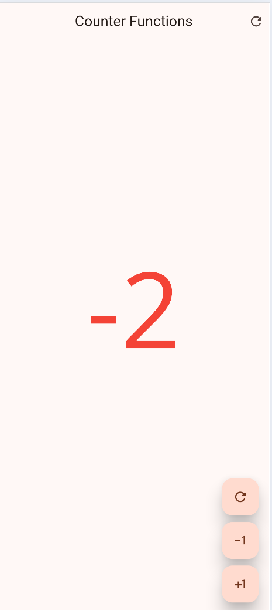
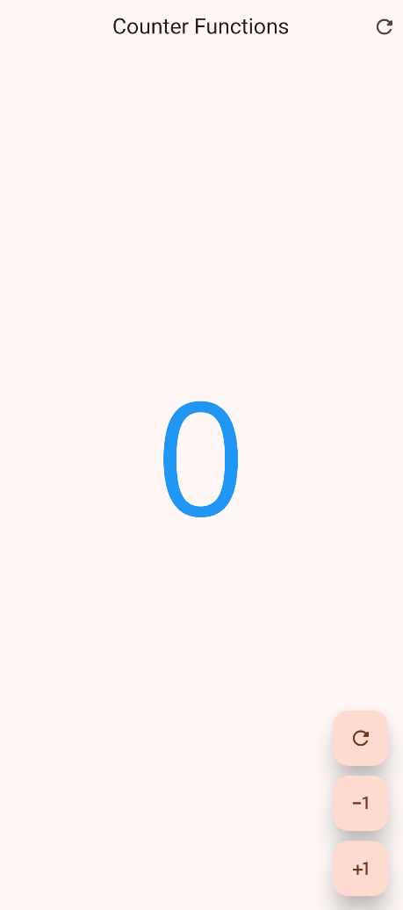
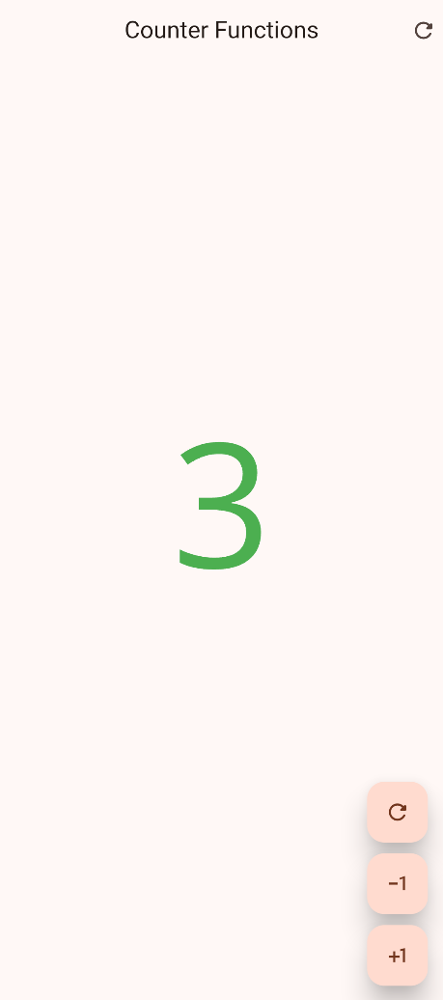
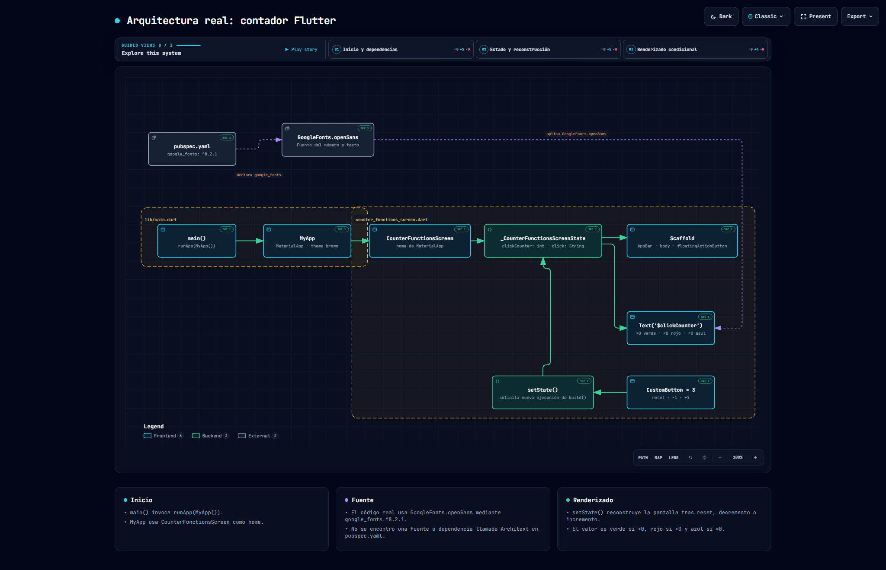

# 🔢 Práctica: Contador con funciones, colores y tipografía personalizada en Flutter

## Descripción
Esta aplicación fue desarrollada con Flutter y Dart para ofrecer un contador interactivo capaz de incrementar, decrementar y restablecer su valor numérico mediante botones de acción. Asimismo, incorpora lógica visual reactiva para indicar el estado del contador (positivo, negativo o neutro) a través de cambios de color y estilos de texto personalizados.

---

## Objetivo
Implementar la gestión de estado dinámico mediante `StatefulWidget` y `setState()`, integrando personalización de interfaz con evaluación condicional de colores, creación de widgets reutilizables y carga de tipografía externa.

---

## ¿Qué se realizó?
* **Manejo del contador:** Inicialización del valor en `0` con capacidades de incremento (+1), decremento (-1) y reinicio instantáneo a cero.
* **Colorimetría condicional:**
  * 🟢 **Verde:** Cuando el valor es positivo (> 0).
  * 🔴 **Rojo:** Cuando el valor es negativo (< 0).
  * 🔵 **Azul:** Cuando el valor es igual a cero (= 0).
* **Reactividad:** Actualización inmediata de la vista mediante la invocación de `setState()`.
* **Modularidad:** Creación del widget reutilizable `CustomButton` para la botonera flotante.
* **Adaptación léxica:** Cambio automático entre los textos `Click` y `Clicks` según la cifra activa.
* **Estilos y Assets:** Configuración e importación de la fuente personalizada *Architext* en `pubspec.yaml` y aplicación de un tema global verdoso mediante `ThemeData`.

---

## Archivos principales modificados
* `lib/main.dart`: Punto de entrada de la app, definición del tema principal, fuente *Architext* y ruta a la pantalla inicial.
* `lib/presentation/screens/counter/counter_functions_screen.dart`: Lógica de negocio del contador, manejo del estado, botones y renderizado condicional de colores.
* `pubspec.yaml`: Registro y vinculación de la tipografía personalizada *Architext*.

---

## Evidencias

### 1. Contador con valor negativo
El valor del contador se renderiza en color **rojo** cuando la cifra es menor a cero.

*Figura 1: Estado negativo en color rojo.*

### 2. Contador en cero
Al estar en su estado inicial o neutro (`0`), la cifra se muestra resaltada en color **azul**.

*Figura 2: Estado neutro en color azul.*

### 3. Contador con valor positivo
Cuando el acumulado supera el cero, el número conmuta automáticamente a color **verde**.

*Figura 3: Estado positivo en color verde.*

---

## Tecnologías utilizadas
* **Flutter**
* **Dart**
* **Material Design**
* **Architext**
* **Archify**

---

### Diagrama de Arquitectura

> Haz clic en el diagrama para abrir la versión interactiva con vistas guiadas, cambio de tema y exportación.

Git hub pages: https://jonathan2536.github.io/Practicas_DMI_230318/

---

## Resultado
El proyecto cumple satisfactoriamente con los requerimientos asignados: el contador responde de forma precisa a las interacciones del usuario y adapta de manera fluida su aspecto gráfico (colores y tipografía) en función de su valor actual.
